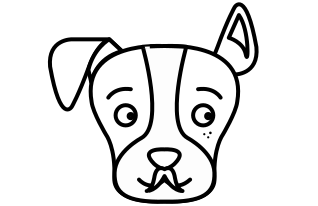

   

   		

       	<h1 class="titel">Breng honden en senioren in contact</h1>
       	<h3 class="onderTitel">Laat uw hond gaan wandelen met onze senioren</h3>
       	<a href="#doemee">Ik doe mee</a>
       	
		

       	<h1 class="titel">

Voor de gezonheid van de senior en dat van je hond

</h1>
       	<h3 class="onderTitel">
Breng je hond naar een van de vele seniorenvoorzieningen in Gent en laat hem rondwandelen met een vriendelijke senior
		</h3>
<a name="doemee">

	
  <h4 class="h4Titel"><a href="dog.html">Voor de baasje</a></h4>

	
  <h4 class="h4Titel"><a href="compagnie.html">Seniorenvoorzieningen</a></h4>

		

</a>

   

<!-- Bottom scripts -->
  
   

